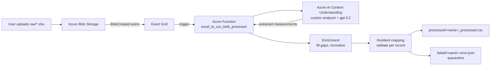

# DataMappingMVP

An Azure-based pipeline that transforms unstructured Excel test logs into clean, standardized CSV data using Blob Storage, Event Grid, Azure Functions, and Azure AI Content Understanding.

For step-by-step local testing and Azure deployment instructions, refer to [instructions.md](instructions.md).

---

## Overview

This project shows how to convert unstructured spreadsheets in which each row follows a different format, with inconsistent units, separators, timestamps, and cell placement into a fixed column schema, and write the result as a CSV. Records that cannot be confidently mapped are quarantined for review.

- **Input:** an `.xlsx` file uploaded to Blob Storage (`raw/` container).
- **Output:** a normalized `<name>_processed.csv` file in the `processed/` container.
- **Quarantine:** a `<name>.error.json` file in the `failed/` container for any records that fail validation. A single invalid record does not cause the entire file to fail.

---

## Architecture



**Processing flow:** a file uploaded to `raw/` raises an Event Grid `BlobCreated` event, which triggers the Function. The Function submits the file to Content Understanding (base64-encoded JSON) and polls for the result. Deterministic enrichment then supplies values that are not present on an individual line, resilient mapping validates each record, and valid rows are written as CSV while invalid rows are quarantined.

---

## Components

### Azure services
| Component | Role |
| --- | --- |
| **Azure Blob Storage** | Holds the `raw`, `processed`, and `failed` containers. The upload to `raw/` starts the pipeline. |
| **Azure Event Grid** | Routes the storage `BlobCreated` event to the Function's webhook. |
| **Azure Functions (Python, Flex Consumption)** | The processing host. Event Grid blob trigger fires when a new `.xlsx` lands in `raw/`. |
| **Azure AI Content Understanding** | AI extraction. A **custom analyzer** reads the messy Excel and returns structured measurement records. |
| **Application Insights** | Logging/telemetry for the Function. |
| **Managed identity + `DefaultAzureCredential`** | The Function authenticates to Content Understanding and Storage without keys. |

### Local Python package (`src/data_mapping_mvp/`)
| Module | Role |
| --- | --- |
| **`csv_contract`** | Defines the 25-column output schema, validates each record, performs resilient mapping, and serializes rows to CSV. |
| **`enrichment`** | Applies deterministic gap-filling: constants, work-order propagation, station-ID normalization, spec-limit lookup, and result synonyms. |

---

## The output data contract (25 columns)

Defined in [src/data_mapping_mvp/csv_contract.py](src/data_mapping_mvp/csv_contract.py):

```
Record_ID, Event_Timestamp, Work_Order, Serial_Number, Line, Shift,
Station_ID, Test_Category, Measurement_Name, Measurement_Value,
Measurement_Unit, Lower_Spec_Limit, Upper_Spec_Limit, Target_Value,
Test_Duration_s, Result, Attempt_Number, Error_Code, Operator_ID,
Fixture_ID, Recipe_ID, Ambient_Temp_C, Humidity_pct,
Source_Record_Text, Notes
```

- **Required per record:** `Serial_Number`, `Test_Category`, `Measurement_Name`, `Result`, `Source_Record_Text` (`Record_ID` is auto-assigned).
- **`Result` allowed values:** `PASS`, `FAIL`, `REVIEW`, `HOLD`, `INFO`.

---

## Repository layout

| Path | Description |
| --- | --- |
| [instructions.md](instructions.md) | Step-by-step guide for local testing and Azure deployment. |
| [function_app.py](function_app.py) | The Azure Function: Event Grid blob trigger, Content Understanding invocation and polling, extraction, and orchestration into CSV and quarantine outputs. |
| [src/data_mapping_mvp/csv_contract.py](src/data_mapping_mvp/csv_contract.py) | The 25-column contract, per-record validation, resilient mapping, and CSV serialization. |
| [src/data_mapping_mvp/enrichment.py](src/data_mapping_mvp/enrichment.py) | Deterministic gap-filling rules. |
| [excel_csv_mvp_analyzer.json](excel_csv_mvp_analyzer.json) | The Content Understanding custom-analyzer schema, including the fields to extract and the anti-fragmentation prompt. |
| [tests/](tests/) | Offline tests for the contract, enrichment, extraction, and end-to-end mapping. |
| [fixtures/content_understanding_response.json](fixtures/content_understanding_response.json) | A recorded analyzer response that allows tests to run without calling Azure. |
| [SampleData/](SampleData/) | The raw input sample together with the desired normalized output and data dictionary. |
| [infra/main.bicep](infra/main.bicep) | Infrastructure-as-code definition for the Azure resources. |
| [infra/main.parameters.json](infra/main.parameters.json) | Deployment parameters. Resource names must be updated for each deployment. |
| [azure.yaml](azure.yaml) | Azure Developer CLI (`azd`) project definition. |
| [host.json](host.json) | Azure Functions host configuration. |
| [requirements.txt](requirements.txt) | Python dependencies. |

---

## Configuration (Function app settings)

| Setting | Purpose |
| --- | --- |
| `AzureWebJobsStorage__accountName` / `AzureWebJobsStorage__credential` | Identity-based storage access for the host and output writes. |
| `CONTENT_UNDERSTANDING_ENDPOINT` | Base endpoint of the Content Understanding resource. |
| `CONTENT_UNDERSTANDING_ANALYZER_ID` | The analyzer to call (e.g. `assemblyMeasurementAnalyzer3`). |
| `CONTENT_UNDERSTANDING_API_VERSION` | API version (`2025-11-01`). |
| `PROCESSED_CONTAINER` / `FAILED_CONTAINER` | Output container names (default `processed` / `failed`). |
| `DEFAULT_LINE` / `DEFAULT_SHIFT` | Constants used by enrichment when the raw line omits them. |

---

## Getting started

Complete local testing and Azure deployment procedures are documented in [instructions.md](instructions.md). To run the local test suite:

```powershell
python -m venv .venv
.\.venv\Scripts\Activate.ps1
pip install -r requirements.txt
python -m unittest discover -s tests -p "test_*.py"
```

---

## Design principles

- **AI extraction with deterministic enrichment.** Content Understanding extracts the values present on each line, while deterministic Python rules supply the surrounding context that the line does not state (constants, specification limits, and ID normalization). This separation keeps the AI focused and the business rules auditable.
- **Per-record resilience.** Input files commonly contain fragments and partial lines. Rather than failing an entire file on a single invalid record, the pipeline quarantines the affected records and still produces a clean CSV for the remainder.
- **Model selection.** A higher-capability completion model (`gpt-5.2`) is required to extract every test category from the source data; a lower-capability model captured only the first section.

## License

See [LICENSE](LICENSE).
