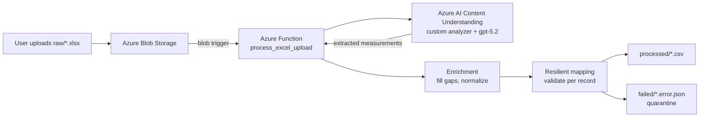

# About DataMappingMVP

## What this project does
DataMappingMVP is an Azure-based pipeline that turns **messy Excel test logs into clean, standardized CSV data**.

The concrete scenario (from the sample data) is **assembly-line test-measurement normalization**: a factory exports an unstructured "raw test dump" spreadsheet where every line is written in a different format (varying units, separators, timestamps, and cell placement). The pipeline reads that file, uses AI to understand it, normalizes each measurement into a fixed 25-column schema, and writes the result as a CSV — quarantining any records it cannot confidently map.

- **Input:** an `.xlsx` uploaded to Blob Storage (`raw/` container).
- **Output:** a normalized `.csv` in the `processed/` container, plus a JSON quarantine record in the `failed/` container for any rows that failed validation.

---

## Architecture at a glance



---

## Components used

### Azure services
| Component | Role |
| --- | --- |
| **Azure Blob Storage** | Holds the `raw`, `processed`, and `failed` containers. The upload to `raw/` is what starts the pipeline. |
| **Azure Functions (Python)** | The processing host. A blob trigger fires when a new `.xlsx` lands in `raw/`. |
| **Azure AI Content Understanding** (Foundry) | AI extraction service. A **custom analyzer** reads the messy Excel and returns structured measurement records. |
| **Foundry model deployments** | `gpt-5.2` (completion, does the actual extraction) and `text-embedding-3-large` (embeddings), referenced by the analyzer via model *aliases*. |
| **Application Insights** | Logging/telemetry for the Function. |
| **Managed identity + `DefaultAzureCredential`** | The Function authenticates to Content Understanding and Storage without keys. |

### Local Python package
| Module | Role |
| --- | --- |
| **`csv_contract`** | Defines the 25-column output schema, validates each record, and serializes rows to CSV. |
| **`enrichment`** | Fills in the fields the AI cannot read off a single line (constants, spec limits, ID normalization). |

---

## Step-by-step: how the process works

1. **Upload** — A user drops a raw workbook into the `raw/` container (e.g. `synthetic_assembly_line_test_measurements_raw.xlsx`).
2. **Trigger** — The blob trigger `process_excel_upload` in [function_app.py](function_app.py) fires with the file bytes.
3. **Send to AI** — `analyze_excel_blob` submits the file to the Content Understanding analyzer as a JSON request with base64-encoded file data (`{"inputs":[{"data":"<base64>"}]}`), then polls the async operation until it finishes.
4. **Extract** — `extract_canonical_payload_from_analyzer_result` walks the analyzer response and turns each returned `measurements` item into a plain Python dict (one dict per measured characteristic).
5. **Enrich** — `enrich_measurements` in [src/data_mapping_mvp/enrichment.py](src/data_mapping_mvp/enrichment.py) fills the gaps the raw line does not state:
   - **Constants:** default `Line` / `Shift`.
   - **Work-order propagation:** copies the single work order to rows that omit it.
   - **Station-ID normalization:** raw headers like `"Torque Station 01"` → `STN-01`.
   - **Spec-limit reference table:** looks up lower/upper/target/duration by (category, measurement).
   - **Result synonyms:** maps `OK`/`GOOD`/`Y`/`accepted` → `PASS`, `FAIL-LOW` → `FAIL`, etc.
6. **Map & validate (resilient)** — `map_measurements_resilient` in [src/data_mapping_mvp/csv_contract.py](src/data_mapping_mvp/csv_contract.py) processes each record independently:
   - Valid records become CSV rows with sequential `Record_ID`s.
   - Invalid records (missing a required field or a bad `Result`) are **quarantined** with the reason — one bad record never fails the whole file.
7. **Write outputs** — The Function writes:
   - the CSV of valid rows to `processed/<name>.csv`, and
   - a quarantine JSON to `failed/<name>.error.json` when any records were quarantined.

---

## The output data contract (25 columns)

Defined in [src/data_mapping_mvp/csv_contract.py](src/data_mapping_mvp/csv_contract.py):

```
Record_ID, Event_Timestamp, Work_Order, Serial_Number, Line, Shift,
Station_ID, Test_Category, Measurement_Name, Measurement_Value,
Measurement_Unit, Lower_Spec_Limit, Upper_Spec_Limit, Target_Value,
Test_Duration_s, Result, Attempt_Number, Error_Code, Operator_ID,
Fixture_ID, Recipe_ID, Ambient_Temp_C, Humidity_pct,
Source_Record_Text, Notes
```

- **Required per record:** `Serial_Number`, `Test_Category`, `Measurement_Name`, `Result`, `Source_Record_Text` (`Record_ID` is auto-assigned).
- **`Result` allowed values:** `PASS`, `FAIL`, `REVIEW`, `HOLD`, `INFO`.

The target schema and its column definitions come directly from the sample workbook `SampleData/assembly_line_measurement_mapping_desired_output.xlsx` (its `Data Dictionary` sheet).

---

## Key files to know

| File | What it is |
| --- | --- |
| [function_app.py](function_app.py) | The Azure Function. Blob trigger, Content Understanding call + polling, response extraction, and orchestration into CSV + quarantine. |
| [src/data_mapping_mvp/csv_contract.py](src/data_mapping_mvp/csv_contract.py) | The 25-column contract, per-record validation, resilient mapping, and CSV serialization. |
| [src/data_mapping_mvp/enrichment.py](src/data_mapping_mvp/enrichment.py) | Deterministic gap-filling: constants, work-order propagation, station-ID normalization, spec-limit table, result synonyms. |
| [excel_csv_mvp_analyzer.json](excel_csv_mvp_analyzer.json) | The Content Understanding custom-analyzer schema (fields to extract + the anti-fragmentation prompt). |
| [tests/test_csv_contract.py](tests/test_csv_contract.py) | Tests for the contract and resilient mapping. |
| [tests/test_enrichment.py](tests/test_enrichment.py) | Tests for the enrichment rules. |
| [tests/test_function_app.py](tests/test_function_app.py) | Tests for extraction and the end-to-end mapping pipeline (uses a recorded fixture). |
| [fixtures/content_understanding_response.json](fixtures/content_understanding_response.json) | A recorded analyzer response so tests run without calling Azure. |
| [SampleData/synthetic_assembly_line_test_measurements_raw.xlsx](SampleData/synthetic_assembly_line_test_measurements_raw.xlsx) | The messy raw input sample. |
| [SampleData/assembly_line_measurement_mapping_desired_output.xlsx](SampleData/assembly_line_measurement_mapping_desired_output.xlsx) | The desired normalized output + data dictionary. |
| [host.json](host.json) | Azure Functions host config (extension bundle, App Insights sampling). |
| [requirements.txt](requirements.txt) | Python dependencies (`azure-functions`, `azure-identity`, `azure-storage-blob`). |
| [infra/main.bicep](infra/main.bicep) | Infrastructure-as-code for the Azure resources. |
| [azure.yaml](azure.yaml) | Azure Developer CLI (`azd`) project definition. |
| [wiki.md](wiki.md) | Running status log — current state, Azure resource names, and the latest end-to-end results. |
| [ExcelToCsvMvpPlan.md](ExcelToCsvMvpPlan.md) | The original MVP plan and design rationale. |

---

## Configuration (Function app settings)

| Setting | Purpose |
| --- | --- |
| `AzureWebJobsStorage` | Storage connection used by the blob trigger and output writes. |
| `CONTENT_UNDERSTANDING_ENDPOINT` | Base endpoint of the Content Understanding resource. |
| `CONTENT_UNDERSTANDING_ANALYZER_ID` | The analyzer to call (currently `assemblyMeasurementAnalyzer3`). |
| `CONTENT_UNDERSTANDING_API_VERSION` | API version (`2025-11-01`). |
| `PROCESSED_CONTAINER` / `FAILED_CONTAINER` | Output container names (default `processed` / `failed`). |
| `DEFAULT_LINE` / `DEFAULT_SHIFT` | Constants used by enrichment when the raw line omits them. |

---

## Running the tests locally

The mapping and enrichment logic is fully testable offline using the recorded fixture:

```powershell
# from the repo root, using the project virtual environment
.\.venv\Scripts\python.exe -m unittest discover -s tests -p "test_*.py"
```

This exercises the contract, enrichment, extraction, and end-to-end mapping without any Azure calls.

---

## Why the design looks the way it does

- **AI extracts, code enriches.** Content Understanding pulls out what is physically on each line; deterministic Python rules add the context that is not on the line (constants, spec limits, ID normalization). This keeps the AI focused and the business rules auditable.
- **Per-record resilience.** Real-world dumps contain fragments and half-lines. Rather than failing an entire file on one bad record, the pipeline quarantines the bad ones and still produces a clean CSV for the good ones.
- **Model choice matters.** A stronger completion model (`gpt-5.2`) was required to extract every test category from the messy input; a weaker model only captured the first section.

For the live status, exact Azure resource names, and the most recent end-to-end results, see [wiki.md](wiki.md).
